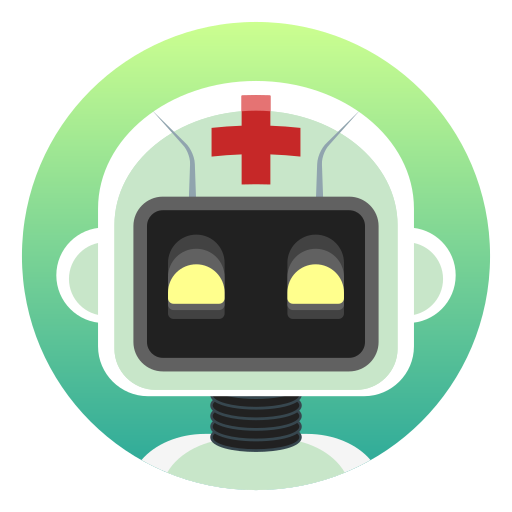

# Welcome to MedAssist  



## MedAssist is an intelligent, multi-agent application designed to provide preliminary medical guidance. It leverages the power of large language models to assist users in understanding symptoms, checking drug interactions, and answering general health questions in a secure and intuitive way.
**Core Problem**

Accessing reliable and immediate medical information can be challenging. Users often face a sea of complex, and sometimes contradictory, information online. Furthermore, discussing sensitive health concerns requires a high degree of privacy that is not always guaranteed.
Our Solution


https://github.com/user-attachments/assets/3dc7d0a8-f910-4c15-8faa-37c031377d2d


### MedAssist addresses these challenges with a three-pronged approach, embodied by its specialized AI agents:

**Symptom Checker Agent:**
This agent allows users to describe their symptoms and, crucially, upload images (e.g., of a skin rash, a pill for identification) for a more comprehensive, multimodal       analysis. It provides potential insights and suggests appropriate next steps.

**Drug Interaction Agent:**
Users can input multiple medications to check for potential adverse interactions, providing a critical layer of safety and information that is often difficult to find.

**General Assistant Agent:**
A conversational AI trained to answer a wide range of general medical questions, acting as an informative first point of contact.

### Key Features

**Multi-Agent Architecture:**
A sophisticated system where different AI agents handle specialized tasks for more accurate and relevant responses.

**Multimodal Input:**
The ability to analyze both text and images to better understand a user's health concerns.

**User-Centric Design:**
A clean, modern, and easy-to-navigate interface that makes complex information accessible.

**Privacy-Focused:**
Designed with user privacy in mind, creating a safe space for health inquiries.

**URL**: (https://medimind-collective-cmqxtyy3d-rishis-projects-2075a3fb.vercel.app/)

## How can I run the app?

**Use your preferred IDE**

If you want to work locally using your own IDE, you can fork this repo and than clone this repo and push changes in your forked repo for further adancments of your choice.

The only requirement is having Node.js & npm installed - [install with nvm](https://github.com/nvm-sh/nvm#installing-and-updating)

Follow these steps:

```sh
# Step 1: Clone the repository using the project's Git URL.
git clone https://github.com/Jha-2022/medassist.git

# Step 2: Navigate to the project directory.
cd medAssist

# Step 3: Install the necessary dependencies.
npm i

# Step 4: Start the development server with auto-reloading and an instant preview.
npm run dev
```

## What technologies are used for this project?

This project is built with:

- Vite
- TypeScript
- React
- shadcn-ui
- Tailwind CSS

## Accessible at:

https://medimind-collective-cmqxtyy3d-rishis-projects-2075a3fb.vercel.app/

**Conclusion**

MedAssist represents a step towards democratizing access to medical information. By combining a specialized multi-agent system with multimodal capabilities, it offers a powerful, private, and user-friendly tool for preliminary health guidance. Our vision is to empower individuals to take a more active role in understanding their health, bridging the gap between curiosity and professional medical advice.


